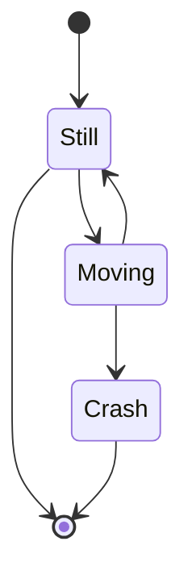

# note_repo
我的笔记仓库



```mermaid
stateDiagram-v2
[*]-->Still
Still-->[*]

Still-->Moving
Moving-->Still
Moving-->Crash
Crash-->[*]
```

## 流程
```
graph LR
[file type]-->{norm}-->(df_shiny)
[file type]-->{raw}-->(df_raw)
(df_raw)--[NORM]--> (df_raw_shiny)

```
